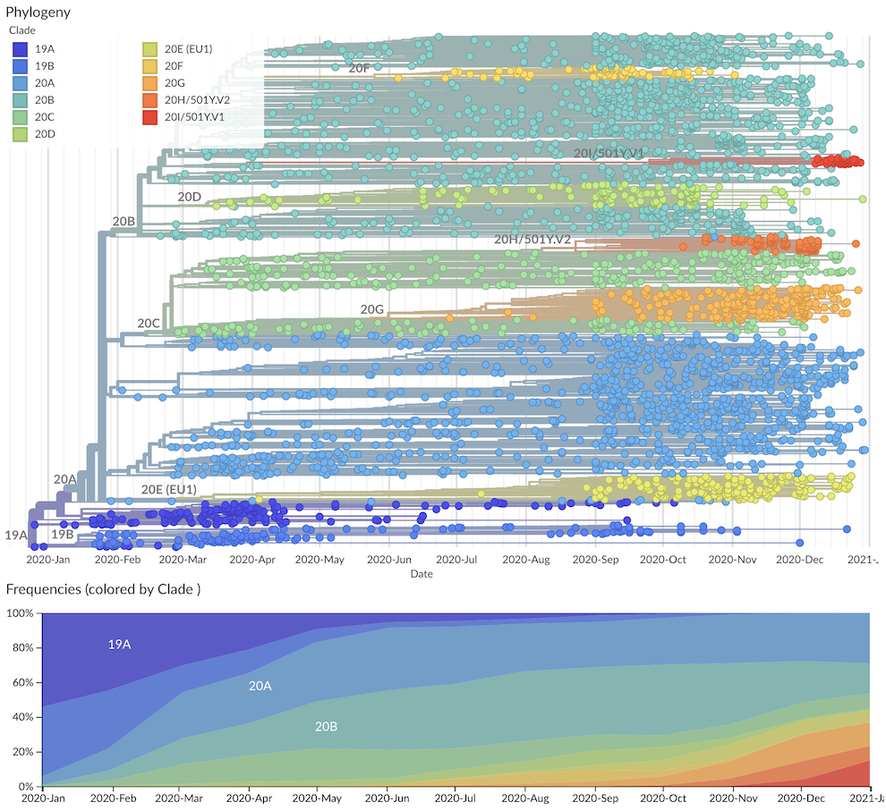
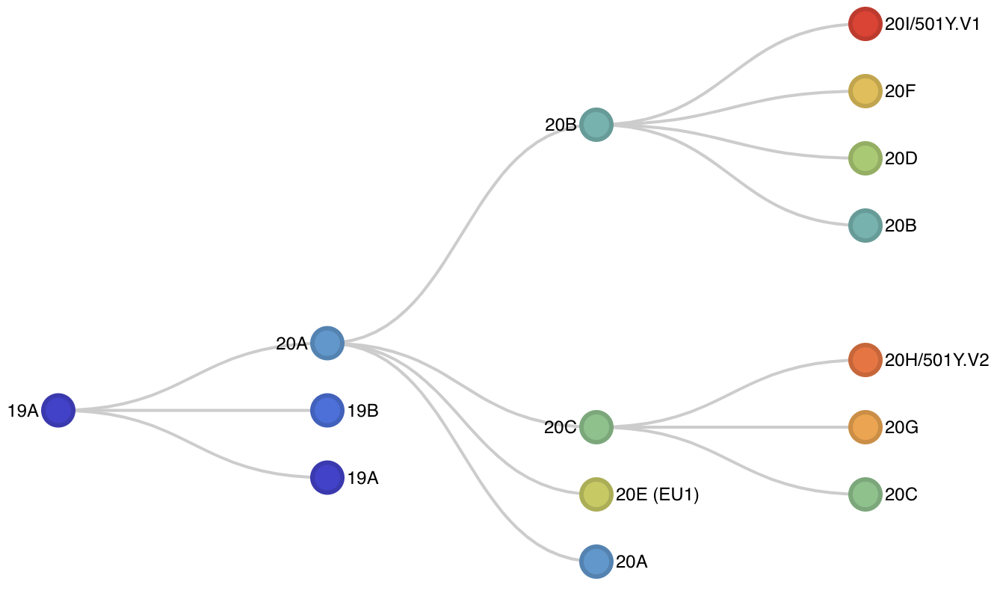

**Trevor Bedford**, **Emma B Hodcroft**, **Richard A Neher**

The emerging 501Y.V1 and 501Y.V2 variants have pushed the Nextstrain team to revise our strategy for Nextstrain clade labels. Here, we propose a backwards-compatible update to make clades more adaptable to the continuing pandemic situation, and more useful to people working on the pandemic today.

In June we put forth an [initial Nextstrain clade naming strategy](/blog/2020-06-02-SARSCoV2-clade-naming/). This basic strategy of flat "year-letter" names was borne out of work with seasonal influenza, where the nested names of 3c2.A1b (etc...) can become unwieldy. In the “year-letter” scheme, years are there to make it easy to know what's being discussed in ~5 years when, for example, clade `20A` is referenced. Our June strategy called for naming of a clade when it reached >20% global frequency for more than 2 months.

However, as the pandemic progressed, lack of international travel made it so that no clades beyond the initial clades `20A`, `20B` and `20C` made it past 20% global frequency. Instead, we've seen "regional" clades that hit appreciable frequency in different continent-level regions of the world. One example is `20A.EU1`, which has risen to [high frequency in Europe in particular](https://nextstrain.org/ncov/europe?c=clade_membership&f_region=Europe&transmissions=hide). When clusters like `20A.EU1` and `20A.EU2` were originally [described in October](https://www.medrxiv.org/content/10.1101/2020.10.25.20219063v2), it seemed like labeling based on regional vs global circulation was of benefit. However, the emergence of fast-spreading "variants" has made it clear that a region-based naming system will have drawbacks when spread is rapidly more global.

Additionally, we recognize that complex, unintuitive names lead to geographic-based terms like "UK variant", which can be harmful to the country involved. Therefore, having relatively simple, intuitive official names without geography is important. Finally, there is the issue where if `20A.EU1` did expand to >20% global frequency, it would be confusing to relabel it from `20A.EU1` to, for example, `20E`.

Consequently, we propose an updated strategy, where major (year-letter) clades are named when any of the following criteria are hit:
1. A clade reaches >20% global frequency for 2 or more months
2. A clade reaches >30% regional frequency for 2 or more months
3. A VOC ('variant of concern') is recognized (applies currently to 501Y.V1 and 501Y.V2)

This results in the [updated clade definitions](https://github.com/nextstrain/ncov/blob/master/defaults/clades.tsv), and the resulting Nextstrain outputs can be seen at:
- [Global](https://nextstrain.org/ncov/global?c=clade_membership)
- [Africa](https://nextstrain.org/ncov/africa?c=clade_membership&f_region=Africa&transmissions=hide)
- [Asia](https://nextstrain.org/ncov/asia?c=clade_membership&f_region=Asia&transmissions=hide)
- [Europe](https://nextstrain.org/ncov/europe?c=clade_membership&f_region=Europe&transmissions=hide)
- [North America](https://nextstrain.org/ncov/north-america?c=clade_membership&f_region=North%20America&transmissions=hide)
- [Oceania](https://nextstrain.org/ncov/oceania?c=clade_membership&f_region=Oceania&transmissions=hide)
- [South America](https://nextstrain.org/ncov/south-america?c=clade_membership&f_region=South%20America&transmissions=hide)

There are 9 major clades identified for 2020 with 6 new clades being added in addition to the original `20A`, `20B` and `20C`. These are `20A` through `20I`. Ordering is based on estimated TMRCA following our original proposal: "we propose to name major clades by the year they are estimated to have emerged and a letter, e.g. `19A`, `19B`, `20A`." Clade 20E (EU1) is the elevated clade `20A.EU1` where the "EU1" parenthetical is retained to help connect these labels.

**Fig 1.** Nextstrain 'global' run with the new Nextstrain major clades labelled.

Importantly, we propose to dual label major clades if they correspond to an emerging “variant of concern” (VOC), so that we have `20H/501Y.V2` and `20I/501Y.V1`. We believe it's useful and informative to have the genetic short-hand for these, as it is self-documenting. In a hypothetical example, if we had a future VOC bearing a hallmark spike 484K mutation, then this variant would be labeled 484K.V1. In this case, these variants are labeled by the relevant spike mutation along with V1, V2, etc. to disambiguate. These disambiguating numbers are assigned in order of identification or announcement.

Along these lines, we had previously recommended labeling subclades within a major clade by specific nucleotide mutations, where, for example, `20G/1927C` refers to viruses bearing nucleotide change 1927C within the `20G` clade. We previously avoided using amino acids as this can draw attention to mutations whose effect is unknown. However, as the pandemic has progressed, it has become clear that spike mutations have become a normalized way to identify clusters. Given that amino acid mutations are often of greater familiarity and importance, we would like to extend this nomenclature to label subclades based on amino acid changes, where, for example, `20B/S.484K` refers to viruses bearing amino acid change 484K in the spike protein within the `20B` clade.

Moving forward, we aim to avoid relabeling. Making clusters of interest major clades more quickly avoids getting into another situation where we'd need to elevate `20A.EU1` to `20E`, which adds confusion. However, we recognise that we may not be able to predict the importance of rising variants perfectly, and will retain flexibility in the system (for example parenthetical use) for situations where complete renaming might cause additional confusion. Our new proposal does require a relabeling of `20B/501Y.V1` to `20I/501Y.V1` and a relabeling of `20C/501Y.V2` to `20H/501Y.V2`, but given they are primarily referred to by the last part of their names, we feel this is acceptable and will not cause undue confusion.

Going forward, we'll commit to keeping these major clades fresher. In this system we estimate 7 clades currently at >5% global frequency and regions with between 2 and 5 clades currently circulating at >5% regional frequency. We feel this is a good resolution to capture important dynamics without being too overwhelming. Additionally, we hope this modified strategy, outlined above, will prevent us from having to relabel in the future.

At this moment, major clades from 2020 onwards are:
- [`20A`](https://nextstrain.org/ncov/global?c=clade_membership&f_clade_membership=20A): basal pandemic lineage bearing S 614G that's globally distributed
- [`20B`](https://nextstrain.org/ncov/global?c=clade_membership&f_clade_membership=20B): derived from 20A bearing N 203K, N204R and ORF14 50N, also globally distributed
- [`20C`](https://nextstrain.org/ncov/global?c=clade_membership&f_clade_membership=20C): derived from 20A bearing ORF3a 57H and ORF1a 265I, also globally distributed
- [`20D`](https://nextstrain.org/ncov/global?c=clade_membership&f_clade_membership=20D): derived from 20B bearing ORF1a 1246I and ORF1a 3278S, concentrated in South America, southern Europe and South Africa
- [`20E`](https://nextstrain.org/ncov/global?c=clade_membership&f_clade_membership=20E): derived from 20A bearing N 220V, ORF10 30L, ORF14 67F and S 222V, concentrated in Europe
- [`20F`](https://nextstrain.org/ncov/global?c=clade_membership&f_clade_membership=20F): derived from 20B bearing ORF1a 300F and S 477N, concentrated in Australia
- [`20G`](https://nextstrain.org/ncov/global?c=clade_membership&f_clade_membership=20G): derived from 20C bearing ORF1b 1653D, ORF3a 172V, N 67S and N 199L, concentrated in the United States
- [`20H/501Y.V2`](https://nextstrain.org/ncov/global?c=clade_membership&f_clade_membership=20H/501Y.V2): derived from 20C bearing S 80A, S 215G, S 484K, S 501Y, S 701V, concentrated in South Africa
- [`20I/501Y.V1`](https://nextstrain.org/ncov/global?c=clade_membership&f_clade_membership=20I/501Y.V1): derived from 20B bearing S 501Y, S 570D, S 681H, ORF8 27*, concentrated in the United Kingdom

**Fig 2.** Schematic showing hierarchical relationships among clades. An interactive version of this diagram is available [here](https://bl.ocks.org/trvrb/66b2c193117220200eb8e09190a43c85).
