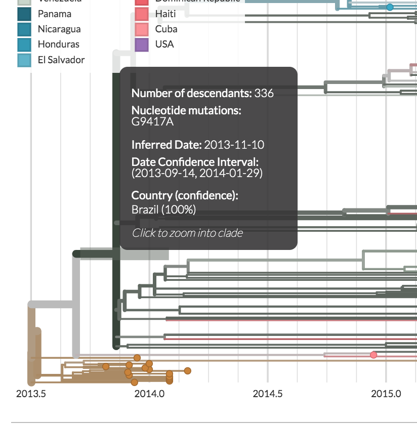

If you look at the [Nextstrain Seasonal Influenza tree](https://nextstrain.org/flu/seasonal/h3n2/ha/3y), you'll see that the clades are labelled (for example, `3c2`, `3c2.A`, `3c3` etc.). However labelled clades are not a default in Nextstrain builds. You may want to add clade labelling to your Nextstrain trees to more easily describe certain aspects of the tree, point out agreed-upon groups that are accepted by the field, or to facilitate zoomed views on the tree when using [Nextstrain narratives](https://nextstrain.org/docs/narratives/introduction). This bit of documentation describes how to add clade labeling to your Nextstrain build.

## Finding Clade Defining Nucleotide Mutations

You can find clade-defining mutations by exploring a Nextstrain tree that you have built previously. By default, Nextstrain trees will show amino acid mutations. While you can certainly define clades by amino acid changes, there may be many clades that you would like to label for which no amino acid mutations have occurred. Thus, it may work better to define clades using nucleotide mutations, which occur more frequently.

Then, head back to the tree. When you hover over a branch in the tree, a dark grey window pops up.
Inside this window, you'll see that there's a header that says `Nucleotide Mutations:`.
In the image below, the clade descended from this branch is defined by a mutation from G to A at site 9417 in the genome.
This is the information that you'll need for defining your clades.

## Defining Clades and Exporting the Results using Augur

To define clades in an Augur analysis, use these instructions in the [Augur documentation [external link]](https://nextstrain-augur.readthedocs.io/en/stable/faq/clades.html).

To include clade information in output from Augur using the `export` command, check out this example in the Tuberculosis tutorial in the [Augur documentation [external link]](https://nextstrain-augur.readthedocs.io/en/stable/tutorials/tb_tutorial.html#export-the-results).